# EduRecommender 
 
Personalised educational content recommendation engine using **Hybrid Search**
(embedding-based retrieval + LLM re-ranking).

---
 
## Live Demos
 
The app is deployed in **two versions** — try both !
 
| Version | Stack | Link |
|---------|-------|------|
| **HuggingFace Spaces** (Recommended) | React + Node.js + Docker | [omarrran-edu-recommender.hf.space](https://huggingface.co/spaces/Omarrran/EDU_Recommender) |
| **Streamlit Cloud** | Python + Streamlit | [edurecommender-irutxxxskykznw5xbd78bn.streamlit.app](https://edurecommender-irutxxxskykznw5xbd78bn.streamlit.app/) |
 
> **Why two versions?** The **HuggingFace Spaces** edition is built with
> React + Express and runs inside a Docker container : it is significantly
> **faster**, more responsive, and optimised for production use. The
> **Streamlit** edition is a Python-native prototype  as per required on Hiring assignmnet that is not much optimzed when loading intailly
> and carries the overhead of Streamlit's re-run model.
 
---
 
## Video Demos

 ### Streamlit Demo


https://github.com/user-attachments/assets/0ef7c65a-2789-44d3-8bba-bdcef3d421b7

 
<video src="YOUR_HF_VIDEO_URL_HERE" controls width="100%">
  Your browser does not support the video tag.
</video>
 
 ### HuggingFace Spaces Demo
https://github.com/user-attachments/assets/dad05a76-1260-4964-b1e1-92acf4d9a36c


 
<video src="YOUR_STREAMLIT_VIDEO_URL_HERE" controls width="100%">
  Your browser does not support the video tag.
</video>
 
---
 
## Features
 
- **Hybrid Search Architecture** — fast semantic retrieval (`sentence-transformers`)
  followed by intelligent LLM re-ranking (`Kimi-K2.5` via HuggingFace Router).
- **Strict Type Safety** — `Difficulty`, `LearningStyle`, `ContentFormat` enums
  replace raw strings; Pydantic models enforce validation constraints.
- **Provider-Agnostic Design** — swap embedding or LLM providers via `.env`
  without touching code.
- **Embedding Cache** — sub-15 ms latency on repeated queries.
- **Graceful Fallback** — rule-based re-ranking when no LLM API key is set.
- **FastAPI Backend** — RESTful endpoints with OpenAPI docs.
- **Streamlit Frontend** — glassmorphism dark UI with auto-mode and preset profiles.
 
---
 
## Quick Start
 
### 1. Install
 
```bash
cd AI_EDU_Recommender
pip install -r requirements.txt
```
 
### 2. Configure
 
Copy the example environment file and add your API key (optional):
 
```bash
cp .env.example .env
```
 
```env
# Enables LLM re-ranking (optional — rule-based fallback works without it)
HF_TOKEN=hf_...
 
# Embedding runs locally by default — no key needed
EMBEDDING_PROVIDER=local
```
 
### 3. Run the API
 
```bash
uvicorn api.main:app --reload --port 8000
```
 
Open [http://localhost:8000/docs](http://localhost:8000/docs) for interactive
API docs.
 
### 4. Run the Streamlit Frontend
 
```bash
streamlit run streamlit_app.py
```
 
### 5. Test
 
```bash
python -m tests.test_api
```
 
---
 
## Project Structure
 
```
AI_EDU_Recommender/
├── app/
│   ├── __init__.py          # Package metadata + __version__
│   ├── config.py            # Environment loader (single source of truth)
│   ├── schemas.py           # Enums + Pydantic models with validation
│   ├── data.py              # 10 content items + 3 user profiles
│   ├── embeddings.py        # Embedding generation + cosine retrieval
│   ├── llm_ranker.py        # LLM re-ranking with rule-based fallback
│   └── recommender.py       # Pipeline orchestrator with timing
├── api/
│   ├── __init__.py
│   └── main.py              # FastAPI endpoints
├── tests/
│   └── test_api.py          # Integration test
├── docs/
│   ├── architecture.md      # System architecture
│   └── Deep_Architecture.md # Detailed component diagrams
├── .devcontainer/
│   └── devcontainer.json    # Dev container config
├── streamlit_app.py         # Streamlit glassmorphism frontend
├── env.example              # Environment template
├── .gitignore
├── requirements.txt
└── README.md
```
 
---
 
## API Endpoints
 
| Method | Path         | Description                           |
| ------ | ------------ | ------------------------------------- |
| GET    | `/health`    | Liveness probe                        |
| GET    | `/content`   | Full content catalogue                |
| GET    | `/users`     | Mock user profiles                    |
| POST   | `/recommend` | Top-3 personalised recommendations    |
 
### Example Request
 
```bash
curl -X POST http://localhost:8000/recommend \
  -H "Content-Type: application/json" \
  -d '{
    "user_id": "u1",
    "name": "Alice",
    "goal": "Learn to deploy ML models into production using Kubernetes",
    "learning_style": "visual",
    "preferred_difficulty": "Intermediate",
    "time_per_day": 60,
    "viewed_content_ids": [1],
    "interest_tags": ["ml", "deployment", "kubernetes"]
  }'
```
 
---
 
## Architecture
 
See [docs/architecture.md](docs/architecture.md) for the system overview and
[docs/Deep_Architecture.md](docs/Deep_Architecture.md) for sequence diagrams
and component interactions.

```mermaid
graph LR
    %% Nodes
    User((👤 Learner))
    
    subgraph "Local Execution"
        App[ EduRecommender]
        Emb[ Embeddings]
    end
    
    Cloud[ LLM Router]

    %% Flow
    User -->|Profile| App
    App -->|Vector Search| Emb
    App -->|Re-Rank Candidates| Cloud
    App -->|Recommendations| User
```


 
```
User Profile ──> Embed ──> Cosine Similarity ──> Top-5 ──> LLM Re-Rank ──> Top-3
                   │                                            │
              sentence-transformers                   Kimi-K2.5 / Rules
```
 
---
 
## Deployment Comparison
 
| Feature | HuggingFace Spaces | Streamlit Cloud |
|---------|-------------------|-----------------|
| **Stack** | React + Node.js + Docker | Python + Streamlit |
| **Responsiveness** | Instant (SPA, no page re-runs) | Slower (full script re-run) |
| **Cold start** | Fast (Docker pre-built) | Slower (pip install on wake) |
| **UI framework** | Custom glassmorphism CSS | Streamlit widgets + injected CSS |
| **LLM re-ranking** | Optional (server-side) | Optional (direct call) |
| **Best for** | Production / portfolio | Prototyping / quick iteration |
---
 
## Configuration Reference
 
| Variable               | Default                          | Description                      |
| ---------------------- | -------------------------------- | -------------------------------- |
| `HF_TOKEN`             | —                                | HuggingFace token for LLM       |
| `OPENROUTER_API_KEY`   | —                                | Alternative LLM key              |
| `LLM_MODEL`            | `moonshotai/Kimi-K2.5:novita`    | Chat-completion model slug       |
| `LLM_BASE_URL`         | HuggingFace Router               | Chat-completion endpoint         |
| `EMBEDDING_PROVIDER`   | `local`                          | `local` or `api`                 |
| `EMBEDDING_MODEL_LOCAL`| `all-MiniLM-L6-v2`              | sentence-transformers model      |
| `EMBEDDING_MODEL_API`  | `text-embedding-ada-002`         | OpenAI-compatible model          |
| `EMBEDDING_API_KEY`    | —                                | API key for cloud embeddings     |
 
---
 
## License
 
MIT
