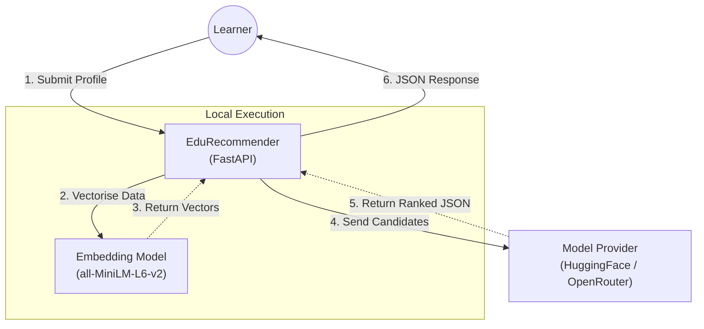
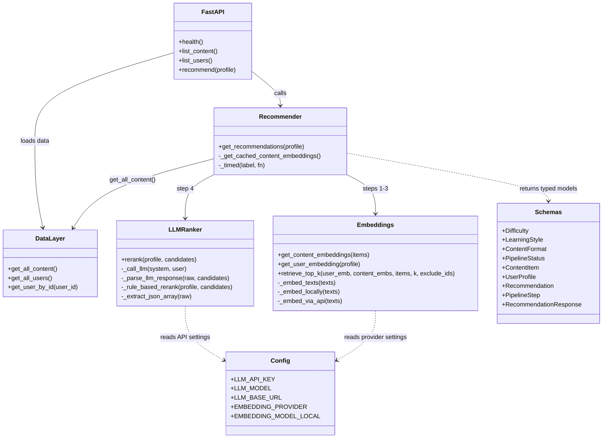
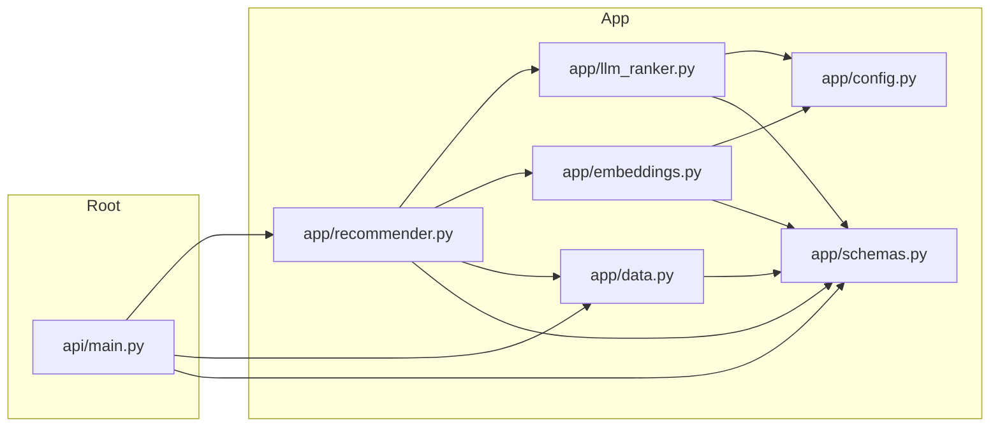

# Architecture Deep Dive — EduRecommender (Clean Code Edition)

Detailed internal structure, data flow, and component interactions.

---

## 1. System Context

The system is a Python application (FastAPI backend) orchestrating a local
embedding model and an external LLM for personalised content recommendations.

---

## 2. Execution Flow (Sequence Diagram)

How a recommendation request flows through the pipeline.

```mermaid
sequenceDiagram
    participant C as Client
    participant API as FastAPI
    participant REC as Recommender
    participant DATA as Data Layer
    participant EMB as Embeddings
    participant LLM as LLM Provider

    C->>API: POST /recommend (profile JSON)
    API->>REC: get_recommendations(profile)

    rect rgb(20, 20, 30)
        note right of REC: Step 1 — Embed Content (cached)
        REC->>EMB: get_content_embeddings(items)
        EMB-->>REC: ndarray [10 x 384]

        note right of REC: Step 2 — Embed User
        REC->>EMB: get_user_embedding(profile)
        EMB-->>REC: ndarray [1 x 384]

        note right of REC: Step 3 — Retrieval
        REC->>REC: cosine_similarity -> top-5

        note right of REC: Step 4 — Re-Rank
        REC->>LLM: POST chat/completions (prompt + 5 candidates)
        LLM-->>REC: JSON array [3 recommendations]
    end

    REC-->>API: RecommendationResponse
    API-->>C: JSON (recommendations + pipeline_log)
```

---

## 3. Component Diagram

---

## 4. Module Dependency Graph

---

## 5. Key Design Decisions

### 5.1 Hybrid Search

- **Retrieval** — `sentence-transformers` (fast, local, CPU-only) narrows the
  catalogue to 5 candidates.
- **Ranking** — LLM (`Kimi-K2.5`) reasons about multi-dimensional constraints
  to select the best 3.
- **Benefit** — balances millisecond retrieval speed with intelligent
  constraint satisfaction.

### 5.2 Caching

Content embeddings are cached in a module-level variable keyed by the hash
of content IDs.  Subsequent requests with the same catalogue skip the
embedding step entirely (< 5 ms).

### 5.3 Strict Enums

Raw strings (`"Beginner"`, `"visual"`, `"video"`) are replaced by
`Difficulty`, `LearningStyle`, and `ContentFormat` enums.  This prevents
typo-induced bugs, enables IDE autocompletion, and makes the API schema
self-documenting.

### 5.4 Graceful Degradation

The LLM ranker wraps all network calls in a try/except.  On any failure
(timeout, bad JSON, rate limit), the system transparently falls back to
deterministic rule-based scoring — ensuring the user always receives
recommendations.

### 5.5 Timing Instrumentation

A `_timed()` helper replaces repeated `time.perf_counter()` boilerplate.
Each pipeline step records its duration in milliseconds, exposed in the
`pipeline_log` field of every response.

---

## 6. Performance Characteristics

| Operation                       | Latency      | Notes                        |
| ------------------------------- | ------------ | ---------------------------- |
| Content embedding (first run)   | 50 - 200 ms  | 10 items, then cached        |
| Content embedding (cached)      | < 5 ms       | Hash-based cache hit         |
| User embedding                  | 5 - 20 ms    | Always computed              |
| Cosine similarity retrieval     | < 1 ms       | numpy dot product            |
| LLM re-ranking                  | 2 - 5 s      | Network round-trip           |
| Rule-based ranking              | < 1 ms       | Heuristic scoring            |
| Full pipeline (with LLM)        | 2.5 - 6 s    | Dominated by LLM call        |
| Full pipeline (rules only)      | 50 - 150 ms  | No network latency           |
