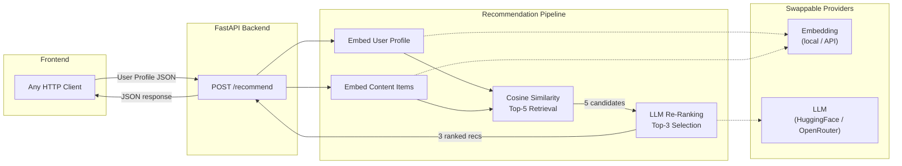

# System Architecture — EduRecommender 

## 1. High-Level Architecture

The system follows a **Retrieval then Re-Ranking** pipeline, a proven pattern
in information retrieval and recommendation systems.



---

## 2. Components

### 2.1 Data Layer (`app/data.py`)

Provides **10 educational content items** across Python, ML, Kubernetes, NLP,
MLOps, and data engineering.  Three **mock user profiles** simulate distinct
learner personas:

| User  | Goal                  | Style    | Difficulty   |
| ----- | --------------------- | -------- | ------------ |
| Alice | ML deployment         | visual   | Intermediate |
| Bob   | Data science beginner | hands-on | Beginner     |
| Carol | Advanced NLP/LLM      | reading  | Advanced     |

### 2.2 Schema Layer (`app/schemas.py`)

Defines strict Pydantic models with **enum-backed fields**:

- `Difficulty` — `Beginner | Intermediate | Advanced`
- `LearningStyle` — `visual | reading | hands-on`
- `ContentFormat` — `video | slides | lecture`
- `PipelineStatus` — `done | skipped | error`

Validation constraints enforce positive durations, valid score ranges, and
non-empty required fields.

### 2.3 Embedding Module (`app/embeddings.py`)

Converts content descriptions and user profiles into dense vectors for
semantic similarity measurement.

1. **Content embedding** — concatenates `title`, `description`, `tags` into
   a single string, then encodes via the configured provider.
2. **User embedding** — concatenates `goal`, `interest_tags`,
   `learning_style`.
3. **Retrieval** — cosine similarity between user vector and all content
   vectors, excluding already-viewed items, returning top-K candidates.

**Providers** (configured via `.env`):

- **Local** — `sentence-transformers` (`all-MiniLM-L6-v2`).  CPU-only, no
  API key needed.
- **API** — any OpenAI-compatible `/embeddings` endpoint.

### 2.4 LLM Re-Ranker (`app/llm_ranker.py`)

Applies deeper reasoning to candidates: constraint satisfaction, style
matching, and personalised explanations.

**Prompt constraints:**

1. Match learner's preferred difficulty.
2. Item duration must fit daily time budget.
3. Favour formats matching learning style.
4. Never re-recommend viewed content.
5. Generate concise explanation per pick.

**Fallback:** deterministic rule-based ranker using tag overlap, format
preference, and difficulty proximity.

### 2.5 Pipeline Orchestrator (`app/recommender.py`)

Coordinates the full pipeline with caching and step-by-step timing:

```
embed content (cached) -> embed user -> retrieve top-5 -> re-rank -> top-3
```

Uses a `_timed()` helper to eliminate repeated timing boilerplate.

### 2.6 FastAPI Backend (`api/main.py`)

| Endpoint     | Method | Description                       |
| ------------ | ------ | --------------------------------- |
| `/health`    | GET    | Liveness probe                    |
| `/content`   | GET    | Full content catalogue            |
| `/users`     | GET    | Mock user profiles                |
| `/recommend` | POST   | Top-3 personalised recommendations|

CORS middleware enabled for cross-origin frontend access.

---

## 3. Where the LLM Adds Value

| Capability                        | Embedding Retrieval | LLM Re-Ranking |
| --------------------------------- | :-----------------: | :------------: |
| Semantic relevance                | Yes                 | Yes            |
| Constraint satisfaction           | No                  | Yes            |
| Learning-style awareness          | No                  | Yes            |
| Personalised explanations         | No                  | Yes            |
| Edge case / nuance handling       | No                  | Yes            |

Embeddings provide fast **broad relevance** retrieval.  The LLM acts as a
**last-mile intelligent filter** applying multi-dimensional constraints and
generating human-readable justifications.

---

## 4. Configuration and Extensibility

All provider settings live in `.env` via `app/config.py`.  Model swaps
require zero code changes:

- **LLM** — change `LLM_MODEL` to any compatible slug.
- **Embeddings** — change `EMBEDDING_MODEL_LOCAL` or switch to
  `EMBEDDING_PROVIDER=api`.

---

## 5. LLM Re-Ranking Prompt

```text
You are an expert educational content recommender. Re-rank the candidate
items for the learner below and return the top 3 as a strict JSON array.

CONSTRAINTS:
1. Prefer items matching the learner's preferred difficulty.
2. Each item's duration_minutes must fit the learner's time_per_day budget.
3. Favour formats that suit the learning style
   (visual -> video, reading -> slides/lecture, hands-on -> video/lecture).
4. Never recommend already-viewed content.
5. Provide a concise, personalised explanation (1-2 sentences) per pick.

Return ONLY a JSON array with exactly 3 objects, each having:
  rank (int 1-3), id (int), title (str), format (str), difficulty (str),
  duration_minutes (int), tags (list[str]), explanation (str).
No text outside the JSON array.
```
